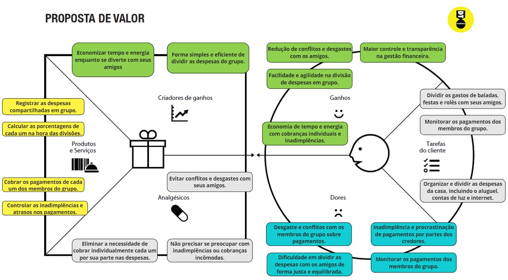
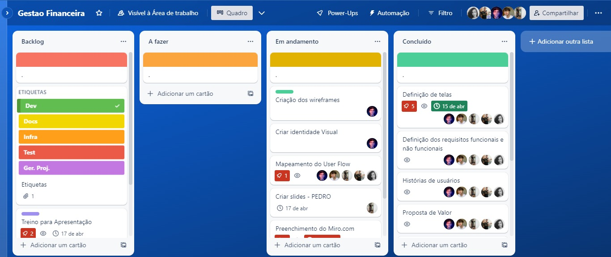

# Informações do Projeto
`DivideUai` 
> O DivideUai é um software que ajuda a resolver um dos maiores problemas financeiros de quem divide contas com amigos ou familiares: como fazer a matemática da divisão certinha e sem confusão. Com ele, é possível criar grupos, registrar todas as despesas e o sistema faz todo o trabalho pesado, dividindo tudo corretamente entre as pessoas. Além disso, o DivideUai também é útil para quem quer ter um controle dos gastos mensais. É uma ótima opção para evitar brigas com amigos por causa de dinheiro e manter as finanças em dia.

`Engenharia de Software` 
>O trabalho interdisciplinar do curso de Engenharia de Software consiste em um projeto que envolve desde a documentação até o desenvolvimento e entrega de um software real. Os alunos são divididos em equipes e, com base em um problema real apresentado pelo professor, desenvolvem todo o processo de engenharia de software, desde a concepção da ideia até a implementação e entrega do produto final. Durante o processo, os alunos aplicam os conhecimentos de diversas disciplinas, como programação, gerenciamento de projetos, e design de interface, trabalhando de forma colaborativa e integrada. O resultado final é um software funcional e de qualidade, que atende às necessidades do cliente e demonstra a competência e habilidades adquiridas pelos alunos ao longo do curso.

## Participantes

> Os membros do grupo são: 
> - Arthur Ferreira Costa
> - Enrique Silva Leite
> - Érica Alves dos Santos
> - Pedro Arthur Oliveira Silva
> - Sthel Felipe Torres

# Estrutura do Documento

- [Informações do Projeto](#informações-do-projeto)
  - [Participantes](#participantes)
- [Estrutura do Documento](#estrutura-do-documento)
- [Introdução](#introdução)
  - [Problema](#problema)
  - [Objetivos](#objetivos)
  - [Justificativa](#justificativa)
  - [Público-Alvo](#público-alvo)
- [Especificações do Projeto](#especificações-do-projeto)
  - [Personas, Empatia e Proposta de Valor](#personas-empatia-e-proposta-de-valor)
  - [Histórias de Usuários](#histórias-de-usuários)
  - [Requisitos](#requisitos)
    - [Requisitos Funcionais](#requisitos-funcionais)
    - [Requisitos não Funcionais](#requisitos-não-funcionais)
  - [Restrições](#restrições)
- [Projeto de Interface](#projeto-de-interface)
  - [User Flow](#user-flow)
  - [Wireframes](#wireframes)
- [Metodologia](#metodologia)
  - [Divisão de Papéis](#divisão-de-papéis)
  - [Ferramentas](#ferramentas)
  - [Controle de Versão](#controle-de-versão)

# Introdução

## Problema

> O problema que o projeto visa solucionar é a dificuldade de gerenciar os gastos em conjunto. Quando várias pessoas compartilham as mesmas despesas, é comum haver divergências sobre quem pagou o quê e quanto cada um deve pagar. Isso pode gerar conflitos e até mesmo prejudicar as relações interpessoais.

## Objetivos

> O objetivo do projeto é desenvolver uma plataforma online que facilite a divisão de gastos em grupo. A plataforma permitirá que os usuários cadastrem as despesas realizadas em conjunto, atribuindo-as às pessoas responsáveis por cada pagamento. A partir disso, a plataforma fará os cálculos necessários para que cada um saiba exatamente quanto deve pagar e a quem. 

## Justificativa

> A justificativa para a criação desse projeto é que ele pode ajudar a evitar conflitos e desentendimentos entre as pessoas que dividem as despesas. Além disso, a plataforma também pode auxiliar na organização e no controle financeiro, o que é importante tanto para quem viaja quanto para quem divide despesas em moradias compartilhadas ou em outros contextos

## Público-Alvo

> O público-alvo do projeto são pessoas de 16 anos a 40 anos que compartilham despesas, como grupos de amigos que viajam juntos, colegas de trabalho que dividem moradia temporária, familiares que dividem as despesas da casa, entre outros. 
 
# Especificações do Projeto

> Nesta parte do documento, serão abordados alguns conceitos e técnicas importantes para a especificação do projeto, como Persona, Empatia e Proposta de Valor.
> - A Persona é uma técnica de design centrado no usuário que consiste em criar uma personagem fictícia que representa um usuário típico do produto ou serviço em questão. Essa técnica ajuda a entender melhor as necessidades, desejos, comportamentos e características dos usuários, permitindo que o projeto seja desenvolvido de forma mais focada e eficaz.
> - A Empatia, por sua vez, é uma habilidade importante para o designer ter em mente durante todo o processo de criação. Ela consiste na capacidade de se colocar no lugar do usuário e entender seus sentimentos, pensamentos e motivações. Com a empatia, é possível criar soluções mais humanizadas e relevantes para os usuários.
> - Por fim, a Proposta de Valor é uma ferramenta que ajuda a definir a proposta única e diferenciada do produto ou serviço em relação aos seus concorrentes. Ela envolve identificar os benefícios que o produto ou serviço oferece para o usuário, além de destacar as características que o diferenciam das outras opções disponíveis no mercado.

## Personas, Empatia e Proposta de Valor
>
> ### Primeira Persona
> **Lucas, 22 anos, solteiro, mora com os amigos, cursando Direito.**
> 
> 
> **PROPOSTA DE VALOR**
> 
> **Um dos maiores problemas de Lucas é o desgate na hora da divisão e pagamento com membros do grupo.**
> 
> ***
> ### Segunda Persona
> **Geraldo, 45 anos, casado, mora com os filhos e a esposa, trabalha como contador.**
> 
> 
> **PROPOSTA DE VALOR**
> 
> **Um dos maiores problemas de Geraldo é a falta de organização e clareza na divisão de gastos com a esposa.**
> 
> ***
> ### Terceira Persona
> **Matheus, 25 anos, mora com a namorada, trabalha como bancário.**
> 
> 
> **PROPOSTA DE VALOR**
> 
> **Um dos maiores problemas de Matheus é a falta de organização ou equilíbrio financeiro..**
> 
> 

## Histórias de Usuários

Com base na análise das personas forma identificadas as seguintes histórias de usuários:

|EU COMO...`PERSONA` | QUERO/PRECISO ...`FUNCIONALIDADE`   |PARA ...`MOTIVO/VALOR`                 |
|--------------------|------------------------------------|----------------------------------------|
|Lucas |Quero poder criar um grupo e adicionar facilmente os membros para compartilhar despesas| Para evitar conflitos e garantir que todos paguem de maneira justa.|

|EU COMO...`PERSONA` | QUERO/PRECISO ...`FUNCIONALIDADE`  |PARA ...`MOTIVO/VALOR`                 |
|--------------------|------------------------------------|----------------------------------------|
|Lucas |Quero receber notificações de pagamentos pendentes e vencidos| Para que possa lembrar os membros do grupo de suas obrigações financeiras sem confrontos.|

|EU COMO...`PERSONA` | QUERO/PRECISO ...`FUNCIONALIDADE`  |PARA ...`MOTIVO/VALOR`                 |
|--------------------|------------------------------------|----------------------------------------|
|Lucas |Quero visualizar relatórios de gastos e despesas compartilhadas| Para que possa entender melhor meus hábitos de consumo e tomar decisões financeiras mais conscientes.|

|EU COMO...`PERSONA` | QUERO/PRECISO ...`FUNCIONALIDADE`  |PARA ...`MOTIVO/VALOR`                 |
|--------------------|------------------------------------|----------------------------------------|
|Lucas |Quero poder adicionar facilmente despesas de eventos compartilhados| Para que possamos dividir as contas de maneira justa e sem complicações.|

|EU COMO...`PERSONA` | QUERO/PRECISO ...`FUNCIONALIDADE`  |PARA ...`MOTIVO/VALOR`                 |
|--------------------|------------------------------------|----------------------------------------|
|Geraldo |Eu quero um software que facilite a divisão de gastos em grupo| Para evitar conflitos e desgastes com os membros do grupo e ter um controle mais eficiente dos gastos.|

|EU COMO...`PERSONA` | QUERO/PRECISO ...`FUNCIONALIDADE`  |PARA ...`MOTIVO/VALOR`                 |
|--------------------|------------------------------------|----------------------------------------|
|Geraldo |Eu quero ter um controle mais eficiente dos gastos em casa| Para evitar desperdícios e garantir que todos os membros da família possam contribuir com as despesas de forma equilibrada e justa.|

|EU COMO...`PERSONA` | QUERO/PRECISO ...`FUNCIONALIDADE`  |PARA ...`MOTIVO/VALOR`                 |
|--------------------|------------------------------------|----------------------------------------|
|Mathues |Eu quero um software que facilite a divisão de gastos em casa e que me ajude a ter clareza sobre meus gastos| Para ter uma melhor organização financeira.|

|EU COMO...`PERSONA` | QUERO/PRECISO ...`FUNCIONALIDADE`  |PARA ...`MOTIVO/VALOR`                 |
|--------------------|------------------------------------|----------------------------------------|
|Mathues |Eu quero ter um controle mais eficiente dos gastos em casa| Para evitar desperdícios e garantir que todos os membros da família possam contribuir com as despesas.|

## Requisitos

As tabelas que se seguem apresentam os requisitos funcionais e não funcionais que detalham o escopo do projeto.

### Requisitos Funcionais

|ID    | Descrição do Requisito  | Prioridade |
|------|-----------------------------------------|----|
|RF-001| O sistema deve permitir que usuários possam se cadastrar ou efetuar login | ALTA | 
|RF-002| O sistema deve permitir que o usuário possa criar grupos de acordo com suas necessidades | ALTA |
|RF-003| O sistema deve adicionar novos usuários em grupos específicos | MÉDIA |
|RF-004| O sistema deve permitir que o usuário possa criar, editar e excluir grupos de acordo com suas necessidades | MÉDIA |
|RF-005| O sistema deve permitir que o usuário possa calcular automaticamente a divisão de gastos e retornar para cada individuo do grupo o valor a ser pago e para quem deve ser pago | BAIXA |
|RF-006| O sistema deve permitir que o usuário veja o histórico de seus gastos pessoais ou em grupo | MÉDIA |

### Requisitos não Funcionais

|ID     | Descrição do Requisito  |Prioridade |
|-------|-------------------------|----|
|RNF-001| O sistema deve ser seguro para cadastro de dados | MÉDIA | 
|RNF-002| O sistema deve ser compatível para diversos navegadores e dispositivos  |  MÉDIA | 
|RNF-003| O sistema deve ser fácil de usar e intuitivo  |  BAIXA | 
|RNF-004| O sistema deve retornar respostas rápidas às solicitações do usuário  |  BAIXA |

## Restrições

O projeto está restrito pelos itens apresentados na tabela a seguir.

|ID| Restrição                                             |
|--|-------------------------------------------------------|
|01| O projeto deverá ser entregue até o final do semestre |
|02| O aplicativo deve se restringir às tecnologias básicas da Web no Frontend|
|03| A equipe não pode subcontratar o desenvolvimento do trabalho.|

# Projeto de Interface

> O nosso sistema possui diversas telas que permitem uma experiência completa ao usuário. As telas incluem a de cadastro e login, que são necessárias para acessar o sistema. Já a tela inicial permite uma visualização prévia do histórico de gastos e dos grupos já criados, o que torna o acesso ao sistema mais ágil.
> Ao acessar o menu, o usuário poderá selecionar diferentes opções, como Grupos, onde é possível visualizar e criar grupos, e Eventos, onde é possível visualizar eventos ou criar novos. Além disso, o menu Histórico permite visualizar os gastos lançados nos grupos ou eventos, facilitando a compreensão da movimentação financeira do usuário.
> O nosso site foi desenvolvido para atender os requisitos funcionais e não-funcionais, que foram levantados durante a documentação e as histórias de usuário. Esses requisitos foram elaborados com base nas necessidades dos clientes, que desejam ter a possibilidade de criar grupos e lançar gastos, visualizar o histórico de gastos lançados, fazer divisão de gastos e outras funcionalidades que tornam a gestão financeira mais fácil e eficiente.

## User Flow
> 
> 

## Wireframes

## Tela - Login

> A Tela de Login permite o usúário acesse o nosso software, DivideUai.
> - Email: campo onde o usuário insere seu endereço de email registrado na plataforma.
> - Senha: campo onde o usuário insere a senha associada à sua conta.
> - Esqueci minha senha: opção que permite que o usuário redefina sua senha em caso de esquecimento ou perda.
> - Botão de acessar: botão que, quando clicado, verifica as credenciais do usuário e, se for bem-sucedido, concede acesso ao sistema.

> 

## Tela - Cadastro

> A Tela de Cadastro permite o usúário de casastre no nosso software, DivideUai.
> - Email: campo onde o usuário insere seu endereço de email registrado na plataforma.
> - Senha: campo onde o usuário insere a senha associada à sua conta.
> - Começar a usar: botão que, quando clicado, verifica as credenciais do usuário e, se for bem-sucedido, concede acesso ao sistema.

> 

## Tela - Home Page
> Ao acessar ou se cadastrar na DivideUai, será possível visualizar a página inicial, que possui um cabeçalho lateral do lado esquerdo, com os seguinte menus:
> - Home
> - Grupos
> - Eventos
> - Histórico 
> - Configurações  
> 
> E além disso, é possível pesquisar por nome ou código do nome do grupo/evento criado, é possível ter uma pré-visualização dos seus grupos ou do histórico dos seus gastos lançados. 

> 

## Tela - Grupos
> Ao Acessar o menu Grupos, o usuário será direcionado para uma tela de Grupos, onde será possível visualizar ou grupos criados ou criar caso necessário. 

> 

## Tela - Eventos

> Ao acessar o menu de Eventos, o  usuários será direcionado para uma tela de Eventos, onde será possível visualizar os eventos criados ou criar caso necessário.

> 

## Tela - Histórico

> Ao acessar o menu de Histórico, o usúario será direcionado para a tela de Históricos, onde será possível visualizar todos os seus gastos lançados, com a descrição, categoria, valor, data, grupo  e reponsáveis, também será possível filtrar por eventos ou grupos.

> 

## Tela - Lançar Gastos

> Ao criar um evento, será possível fazer o lançamento de gastos dentro desse evento, ao clicar no ícone de mais, irá abrir um um modal, que será possível adiconar nos seguintes campos: descrição, categoria, valor, data, grupo  e reponsáveis. Ao fazer lançamentos, será possível visualizar os lançamentos nas telas, e enquanto o evento estiver em aberto, será possível adicionar os gastos, após fechar a conta, automáticamente seus gastos irão ser processados no relatório e serão adicionados no histórico.

> 

## Tela - Relátorio Geral

> Ao acessar a tela de Relátorio Geral, também será possível visualizar o histórico de gastos lançados, e os repasses que deverá ser feitos para cada membro adicionados nos grupos ou membros. 

>  

# Metodologia

> Para começar, o projeto utilizou duas metodologias ágeis muito populares atualmente: o Design Thinking e o Scrum. O Design Thinking é uma abordagem centrada no usuário que busca entender as necessidades e desejos dos usuários para desenvolver soluções inovadoras e criativas. Já o Scrum é um framework ágil para gestão de projetos que se baseia em entregas frequentes e iterativas, organizadas em sprints de curta duração.
>No processo de trabalho, foram utilizadas diversas ferramentas para auxiliar na comunicação, organização e gestão do projeto, como o Trello, OndeDrive, GitHub, Miro e Figma.
> A configuração do projeto no GitHub foi realizada de forma muito simples e intuitiva. Primeiramente, foi criado um repositório para o projeto, onde será armazenado o código-fonte. Em seguida, foram criados branches para cada nova funcionalidade do projeto, permitindo que os membros da equipe trabalhassem em paralelo em diferentes partes do projeto. Por fim, foram criados pull requests para revisão e integração das alterações realizadas nos branches.
> Em resumo, o projeto utilizou as metodologias ágeis Design Thinking e Scrum, bem como diversas ferramentas, como Trello, Miro, OneDrive e GitHub etc, para facilitar a comunicação, organização e gestão do projeto. A configuração do projeto via GitHub foi simples e permitirá a colaboração entre os membros da equipe de forma eficiente.

## Divisão de Papéis
> A equipe está organizada da seguinte maneira:
> - Scrum Master: Arthur
> - Product Owner: Enrique Leite
> - Equipe de Desenvolvimento: Arthur, Enrique, Erica, Pedro e Sthel.
>
> Para organização e distribuição das tarefas do projeto, a equipe está utilizando o Trello estruturado com as seguintes listas:
> - Recursos: esta lista mantém um template de tarefas recorrentes com as configurações padronizadas que todos devem seguir. O objetivo é permitir a cópia destes templates para agilizar a criação de novos cartões.
> - Backlog: recebe as tarefas a serem trabalhadas e representa o Product Backlog. Todas as atividades identificadas no decorrer do projeto também devem ser incorporadas a esta lista.
> - A Fazer: Esta lista representa o Sprint Backlog. Este é o Sprint atual que estamos trabalhando.
> - Em andamento: Quando uma tarefa tiver sido iniciada, ela é movida para cá.
> - Concluído: nesta lista são colocadas as tarefas que passaram pelos testes e controle de qualidade e estão prontos para ser entregues ao usuário. Não há mais edições ou revisões necessárias, ele está agendado e pronto para a ação
>
> 
> 
> A tarefas são, ainda, etiquetadas em função da natureza da atividade e seguem o seguinte esquema de cores/categorias:
> - Documentação
> - Desenvolvimento 
> - Infraestrutura
> - Testes
> - Gerência de Projetos.

## Ferramentas

> O Trello foi utilizado para criar um quadro de tarefas, onde foram listadas todas as atividades do projeto e atribuídas aos membros da equipe. O Miro foi utilizado para criar um mapa mental colaborativo, onde foram organizadas as ideias e soluções geradas durante as sessões de Design Thinking. O OneDrive foi utilizado para armazenar e compartilhar arquivos e documentos do projeto, como relatórios e apresentações. O Figma foi utilizado pois é uma ferramenta de design de interface de usuário baseada em nuvem que permite a criação de wireframes, protótipos e designs interativos, permitindo a criação de designs precisos e colaborativos. Por fim, o GitHub foi utilizado para hospedar o código-fonte do projeto e permitir a colaboração entre os membros da equipe.

| Ambiente  | Plataforma              |Link de Acesso |
|-----------|-------------------------|---------------|
|Processo de Design Thinkgin  | Miro | https://miro.com/app/board/uXjVMYD9ye0= | 
|Repositório de código | GitHub | https://github.com/ICEI-PUC-Minas-PPLES-TI/plf-es-2023-1-ti1-0385100-gestao-financeira-4| 
|Documentos do projeto | OneDrive | https://sgapucminasbr-my.sharepoint.com/:f:/g/personal/1456541_sga_pucminas_br/Eqr6PXbV_-FGiHludDMe9bcBJ3Vk-AUCa8rbuYk7MuIuvg?e=RROfKr| 
|Gerenciamento do Projeto | Trello | https://trello.com/invite/b/9zGY7rlk/ATTI1ac77542fc46727aacf251348116eb3152C50BC2/gestao-financeira| 
|Protótipo Interativo | Figma | https://www.figma.com/file/LeH195No6KOcSYYMkdIdv1/DivideUai!?node-id=140%3A1789&t=oFCZ284pPuPSay3Z-1 | 

> Outras ferramentas empregadas no projeto são:
> 
> - Visual Studio Code.
> - Discord
> - GitPages
> 
> Entre as ferramentas empregadas no desenvolvimento do projeto mencionado, temos o Visual Studio Code, um editor de código-fonte gratuito e de código aberto que é utilizado para escrever, depurar e testar o código. O Discord, uma plataforma de comunicação por voz e texto que é muito utilizada para a comunicação entre os membros de uma equipe de desenvolvimento. E, por fim, o GitPages, um serviço que permite hospedar páginas estáticas diretamente a partir de repositórios do GitHub.
> Essas ferramentas são essenciais para o desenvolvimento de um projeto, pois ajudam a garantir uma comunicação eficiente entre os membros da equipe, além de possibilitar a criação de um código organizado, testável e de fácil manutenção.

## Controle de Versão

> A configuração do projeto no Git foi realizada a partir da criação de um repositório remoto no Github, que serviu como o repositório upstream. Em seguida, cada membro da equipe clonou o repositório para sua máquina local e passou a trabalhar em um branch específico, como o branch develop.
> A gerência de tags, merges, commits e branchs foi feita de acordo com o modelo de GitFlow, que é uma abordagem para o controle de versão que define um fluxo de trabalho para o desenvolvimento de software. Nesse modelo, há dois branches principais: o master e o develop. O branch master é utilizado para a versão de produção do software, enquanto o branch develop é utilizado para o desenvolvimento contínuo do software.
> Para gerenciar as diferentes versões do software, foram criados branches específicos para cada funcionalidade, como o branch feature para o desenvolvimento de novas funcionalidades e o branch bugfix para a correção de bugs. Quando uma funcionalidade estava pronta para ser integrada ao branch develop, era feito um merge do branch feature ou bugfix correspondente com o branch develop.
> Para gerenciar as issues, foram criados templates específicos para cada tipo de problema, como o bugfix e o feature. As issues eram atribuídas a membros da equipe e podiam ser comentadas e fechadas quando resolvidas. Além disso, eram feitos pull requests para revisão do código antes de ser integrado ao branch develop.
> Em resumo, a gerência de tags, merges, commits e branchs foi feita seguindo o modelo de GitFlow, enquanto a gerência de issues foi realizada com o uso de templates específicos e atribuição de responsabilidades aos membros da equipe. A utilização do Git em conjunto com o Github permitiu um controle eficiente do versionamento do projeto e uma comunicação eficiente entre os membros da equipe.
> 
> O projeto segue a seguinte convenção para o nome de branchs:
> 
> - `master`: versão estável já testada do software
> - `testing`: versão em testes do software
> - `develop`: versão de desenvolvimento do software
> 
> Quanto à gerência de issues, o projeto adota a seguinte convenção para
> etiquetas:
> 
> - `bugfix`: uma funcionalidade encontra-se com problemas
> - `feature`: uma nova funcionalidade precisa ser introduzida
>
> **GitHub Feature Branch Workflow**:
>
> 
